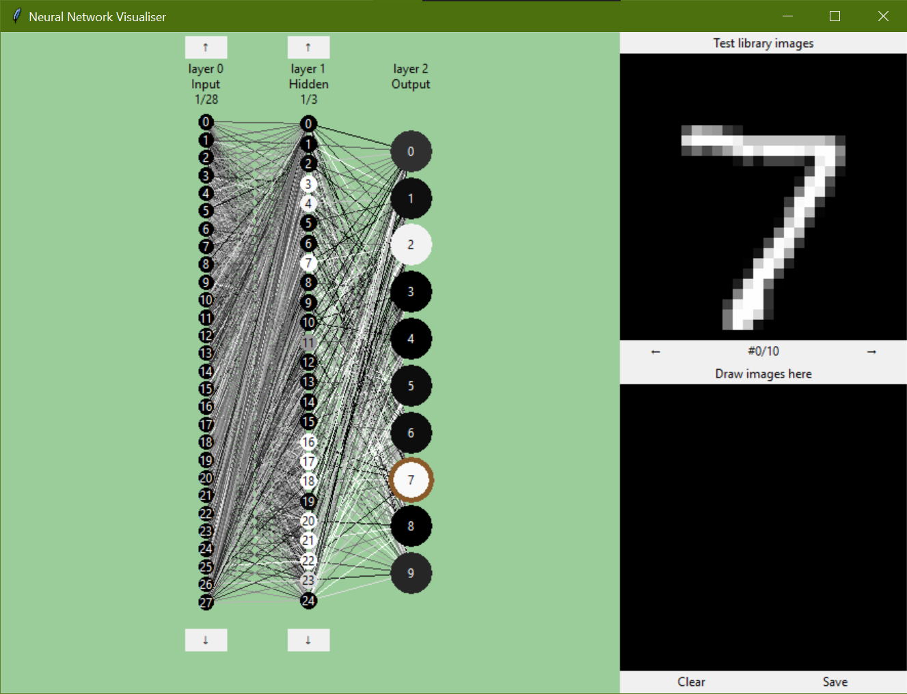

# Neural Network Visualisation
Based on Michael Nielsen's explanations at http://neuralnetworksanddeeplearning.com/. A neural network that can be trained to recognise images and a Tkinter visualiser for the trained network



### The gallery
The gallery view in the top right allowed you to inspect the different training images and what the network predicted.
The colours of the nodes indicates their activity for a given input, white indicating higher activity.
The output node with the highest activity is circled in brown


### Navigation
You can zoom and pan through around the network in order to see the nodes better


There are 784 nodes in the input layer, but only 28 are displayed at a time.
The scrolling arrows allow you to see other nodes that were not initially rendered


### Custom input


You can draw in the bottom right corner and after pressing test, the image will be evaluated by the network
Alternatively, by setting the ```instant_test``` parameter to be True,
it will automatically input the new image data as you draw
The save button will add the drawn image to a custom image folder than can also be browsed in the gallery
